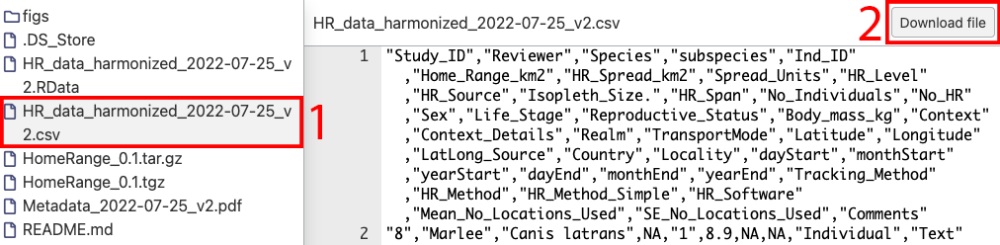
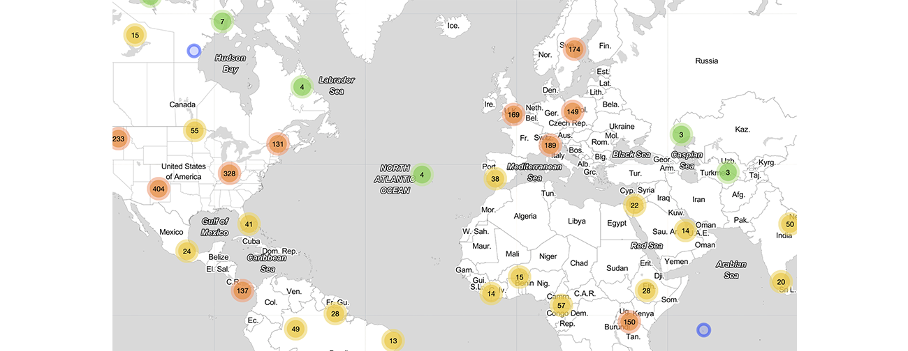
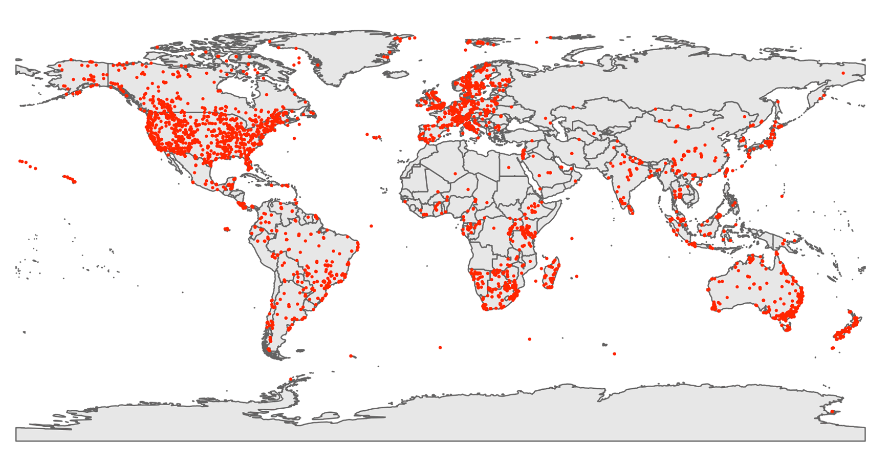
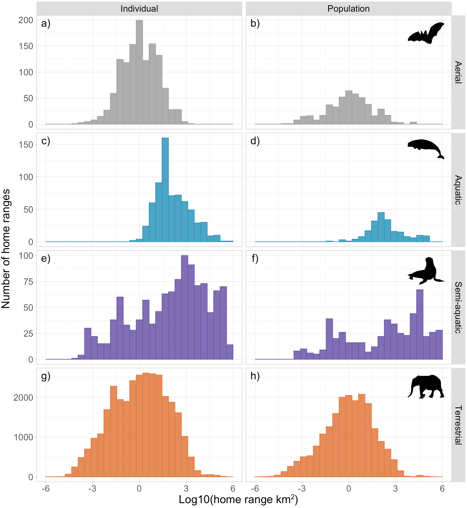

# HomeRange data and R package repository

This is a temporary and anonymous repository containing the HomeRange data and R package, please do not share the link to this page. The package will be moved to a permanent repository once the paper is accepted. The data will be moved to a safe data archiving and access service like DANS Easy or Figshare.

## Access the HomeRange data

The R package can be used to download and import the HomeRange data all from within R using a single function call. However, If you need to use or check the raw data (formatted as a CSV), please use the link in this repository as shown in the image below.



## Interactive map with data points

Visit the interactive HomeRange map using this [link](http://510867850.swh.strato-hosting.eu/Interactive_plot_locations_HR.html)

<a href="http://510867850.swh.strato-hosting.eu/Interactive_plot_locations_HR.html">

</a>

## The data can be downloaded and imported directly using the R package


```r
# install the HomeRange R package
install.packages("https://anonymous.4open.science/r/HomeRange-D913/HomeRange_0.1.tar.gz", 
                 repos=NULL, 
                 method="libcurl")

# load package into R
library('HomeRange')

# package information
?HomeRange

# get the dataset, this function automatically downloads and imports the data
HomeRangeData <- GetHomeRangeData()

# some information on the HomeRange data
head(HomeRangeData)
summary(HomeRangeData)
str(HomeRangeData)
```

## Explore HomeRange data further

```r
# plotting data
PlotMap(HomeRangeData)
PlotHistogram(HomeRangeData)

# get more information
MakeStatTable(HomeRangeData)
```





```r
# match with the COMBINE imputed dataset
# https://esajournals.onlinelibrary.wiley.com/doi/10.1002/ecy.3344
COMBINE <- read.csv("/path/to/combine/trait_data_imputed.csv")
merged_data = MergeWithCOMBINE(HomeRangeData, COMBINE)

# example plot of the merged data
plot(merged_data$Body_mass_kg*1000, 
     merged_data$COMBINE_adult_mass_g,
     log = "xy", pch=21, 
     cex=0.7, bg="grey",
     xlab="body mass g HomeRange",
     ylab="body mass g COMBINE")

abline(0,1,col="red")
```


Version: 2022_07_26_12_01