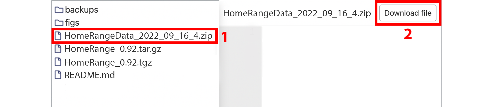

# HomeRange data and R package repository

This is a temporary and anonymous repository containing the HomeRange data and R package, please do not share the link to this page. The package will be moved/archived to a permanent repository once the paper is accepted (e.g. DANS Easy or Figshare).

## Access the HomeRange data

The R package can be used to download and import the HomeRange data all from within R using a single function call (```GetHomeRangeData()```), see example below. However, If you need to use or check the raw data (formatted as a CSV), please download the zip contained in this repository as shown in the image below.



## Metadata

A PDF file with the metadata for the HomeRage dataset can be accessed using this [link](http://510867850.swh.strato-hosting.eu/HomeRangeMetadata_2022_08_24.pdf). Alternatively, it can be viewed from the R package (using ```ViewMetaData()```, see example code below) or it can be downloaded from the main directory in this repository (similar to downloading the zipped data described in the screenshot above).

## Reference list

All references for the home-range values contained in the HomeRange dataset can be found in the ```HomeRangeReferences_2022_09_16.csv``` file included in the ```HomeRangeData_2022_09_16_4.zip``` available from this repository. By setting the ```IncludeReferences``` agrument to ```TRUE``` in the ```GetHomeRangeData()``` function of the R package (```GetHomeRangeData(IncludeReferences = TRUE)```) all references are downloaded and merged with the HomeRange dataset directly.

## Interactive map with data points

Visit the interactive HomeRange map using this [link](http://510867850.swh.strato-hosting.eu/Interactive_plot_locations_HR.html). All links provided are temporary for the double blind review process. On accaptance of the paper everything will be moved to a permenant location.

<a href="http://510867850.swh.strato-hosting.eu/Interactive_plot_locations_HR.html">

</a>

## HomeRange R package

The HomeRange dataset can be downloaded and imported directly using the HomeRange R pacakge

```r
# install the HomeRange R package
install.packages("https://anonymous.4open.science/r/HomeRange-D913/HomeRange_0.92.tar.gz", 
                 repos=NULL, 
                 method="libcurl")

# load package into R
library('HomeRange')

# package information and HomeRange metadata
?HomeRange

# view HomeRange metadata directly as PDF in the browser
ViewMetaData()

# get the dataset, this function automatically downloads and imports the data
HomeRangeData <- GetHomeRangeData() # by default IncludeReferences is set to FALSE

# some information on the HomeRange data
head(HomeRangeData)
summary(HomeRangeData)
str(HomeRangeData)
```

## Explore HomeRange data further

```r
# plotting data
PlotMap(HomeRangeData)
PlotHistogram(HomeRangeData)
```


```r
# get more information
MakeStatTable(HomeRangeData)
```


```r
# match with the COMBINE imputed dataset
# https://esajournals.onlinelibrary.wiley.com/doi/10.1002/ecy.3344
COMBINE <- read.csv("/path/to/combine/trait_data_imputed.csv")
merged_data = MergeWithCOMBINE(HomeRangeData, COMBINE)

# example plot of the merged data
plot(merged_data$Body_mass_kg*1000, 
     merged_data$COMBINE_adult_mass_g,
     log = "xy", pch=21, 
     cex=0.7, bg="grey",
     xlim=c(10^0,10^7), ylim=c(10^0,10^7),
     xlab="body mass g HomeRange",
     ylab="body mass g COMBINE")

abline(0,1,col="red")
```


Updated: 2022_09_18_18_12