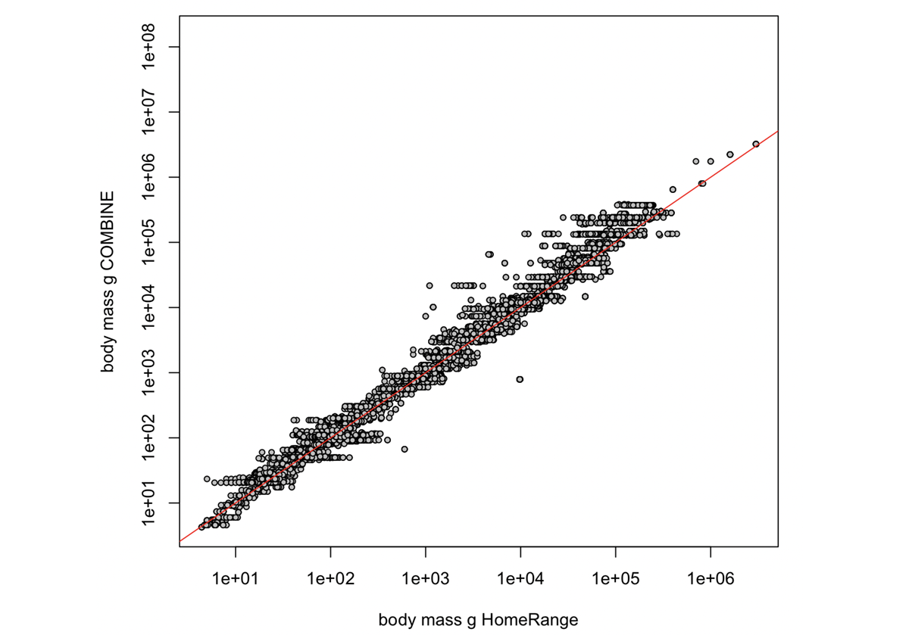

# HomeRange

The HomeRange data contains mammal home-ranges estimates, species names, methodological information on data collection, home-range estimation method, period of data collection, study coordinates and name of location, as well as species traits derived from the studies, such as body mass, life stage, reproductive status and locomotor habit. The data paper describes the contents of HomeRange in more detail:

Broekman, M.J.E., Hoeks, S., Freriks, R., Langendoen, M.M., Runge, K.M., Savenco, E., ter Harmsel, R., Huijbregts, M.A.J. & Tucker, M.A. (Accepted). HomeRange: A global database of mammalian home ranges. Global Ecology and Biogeography.

- The HomeRange data is archived on Dryad: [https://doi.org/10.5061/dryad.d2547d85x](https://doi.org/10.5061/dryad.d2547d85x).
- An interactive map of the HomeRange data can be accessed [here](https://shoeks.github.io/HomeRange/InteractiveMap.html).

## Github Contributors


<a href="https://github.com/TuckerMarlee">

Marlee tucker
</a>

<a href="https://github.com/MaartenBroekman">

Maarten Broekman
</a>

<a href="https://github.com/SHoeks">

Selwyn Hoeks
</a>
<br>

## Access HomeRange from this repository

- <u>HomeRange data</u>: the latest HomeRange data (formatted as a CSV) are contained within the ```HomeRangeData_2022_11_11_1.zip```, which can be downloaded using this [link](https://github.com/SHoeks/HomeRange/raw/main/HomeRangeData_2022_11_11_1.zip)

- <u>Metadata</u>: the metadata PDF for the HomeRage data can be accessed [here](https://shoeks.github.io/HomeRange/HomeRangeMetadata_2022_11_11.pdf). 

- <u>Reference list</u>: all references for the home-range values contained in the HomeRange dataset can be found in the ```HomeRangeReferences_2022_11_11.csv``` file included in the ```HomeRangeData_2022_11_11_1.zip``` available from this repository ([link](https://github.com/SHoeks/HomeRange/raw/main/HomeRangeData_2022_11_11_1.zip)). 

## Access HomeRange using the R package

- <u>HomeRange data</u>: the R package can be used to download and import the HomeRange data all from within R using a single function call ```GetHomeRangeData()``` (see example code below). 

- <u>Metadata</u>: the metadata can be viewed from the R package using ```ViewMetaData()``` or ```vignette(package="HomeRange","Metadata")``` (see example code below).

- <u>Reference list</u>: by setting the ```IncludeReferences``` agrument to ```TRUE``` in the ```GetHomeRangeData()``` function of the R package (```GetHomeRangeData(IncludeReferences = TRUE)```) all references are downloaded and merged with the HomeRange dataset directly.

```r
# install the HomeRange R package
install.packages("https://github.com/SHoeks/HomeRange/raw/main/HomeRange_1.01.tar.gz", 
                 repos=NULL, 
                 method="libcurl")

# load package into R
library('HomeRange')

# package information
?HomeRange

# view HomeRange metadata directly as PDF in the browser
ViewMetaData()

# Or access the metadata from the HomeRange vignettes
vignette(package="HomeRange","Metadata")

# get the dataset, this function automatically downloads and imports the data
HomeRangeData <- GetHomeRangeData() # by default IncludeReferences is set to FALSE

# get data with the references attached
HomeRangeDataWithRefs <- GetHomeRangeData(IncludeReferences = TRUE) 

# some information on the HomeRange data
head(HomeRangeData)
head(HomeRangeDataWithRefs)
summary(HomeRangeData)
str(HomeRangeData)
```

## Explore HomeRange data further

```r
# plotting data
PlotMap(HomeRangeData)
PlotHistogram(HomeRangeData)
```


```r
# get more information
MakeStatTable(HomeRangeData)
```


```r
# match with the COMBINE imputed dataset
# https://esajournals.onlinelibrary.wiley.com/doi/10.1002/ecy.3344
COMBINE <- read.csv("/path/to/combine/trait_data_imputed.csv")
merged_data = MergeWithCOMBINE(HomeRangeData, COMBINE)

# example plot of the merged data
plot(merged_data$Body_mass_kg*1000, 
     merged_data$COMBINE_adult_mass_g,
     log = "xy", pch=21, 
     cex=0.7, bg="grey",
     xlim=c(10^0,10^7), ylim=c(10^0,10^7),
     xlab="body mass g HomeRange",
     ylab="body mass g COMBINE")

abline(0,1,col="red")
```


